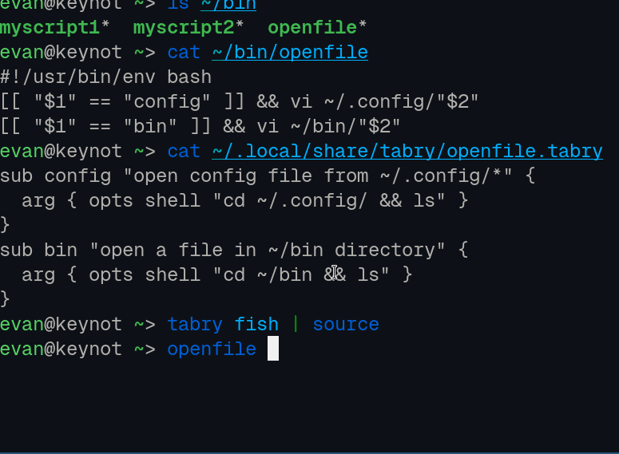

# Tabry (Rust edition)
Tabry is a program and mini-language that allows you to easily create tab completion for 3rd-party programs or your own scripts. Here is an example for [pass](https://www.passwordstore.org/):

```
cmd pass

sub insert {
  flag echo
  flag multiline
}

sub show {
  arg pass-name {
    opts shell "cd ~/.password-store && find -name '*.gpg' | sed 's/.gpg$//'"
  }
}
```

Tabry targets "git-style" CLIs with subcommands, flags, and arguments. Flags can have arguments, and arguments can have options generated by a shell command, a list of constants, or files/directories.

Please see the [documentation in the Ruby project](https://github.com/evanbattaglia/tabry/blob/master/LANGUAGE_REFERENCE.md) for full language documentation.

# Demo

Let's say you have a script `openfile` that opens files in ~/bin or config files in ~/.config/:

```
[[ "$1" == "config" ]] && vi ~/.config/"$2"
[[ "$1" == "bin" ]] && vi ~/bin/"$2"
```

Putting the following file in ~/.local/share/tabry/openfile.tabry and running `source <(tabry bash)` or `tabry fish | source` will give you completions for the two commands "config" and "bin" and argument completions for the files in those directories.

```
sub config "open config file from ~/.config/*" {
  arg { opts shell "cd ~/.config/ && ls" }
}
sub bin "open a file in ~/bin directory" {
  arg { opts shell "cd ~/bin && ls" }
}
```

Demo gif:


The shell command in `opts shell` can of course be much more complicated things including piplines and text manipulation, it just needs to return a newline-separated list of options.

# Installation

## Installing the binary
* Cargo: `cargo install --git https://github.com/evanbattaglia/tabry-rs` (installs to ~/.cargo/bin)
* [nix](nix/README.md)
* build from source with `cargo build`

## Add a completion

```
mkdir -p ~/.local/share/tabry
vi ~/.local/share/tabry/pass.tabry # copy the above example into this file
```

You can also try copying or symlinking some of the files in [examples/tabry/](./examples/tabry/) to `~/.local/share/tabry`.

## Set up with shell

Initialize by adding this to your shell's config, or run once to affect the current shell session:
* Bash: `source <(tabry bash)`
* Zsh: `source <(tabry zsh)`
* Fish: `tabry fish | source`

# Project history

This is a port of [Tabry](https://github.com/evanbattaglia/tabry/) completion engine and compiler to Rust. Because Rust avoids the ~75ms (depending on machine, of course) startup time of Node, Ruby, etc., it is natural choice for the completion engine. Going forward I intend this to be the principal implementation of Tabry, at least for compiling and completion purposes. (The Ruby implementation for at least for now remain for the purposes of building Tabry-compatible CLIs). 

